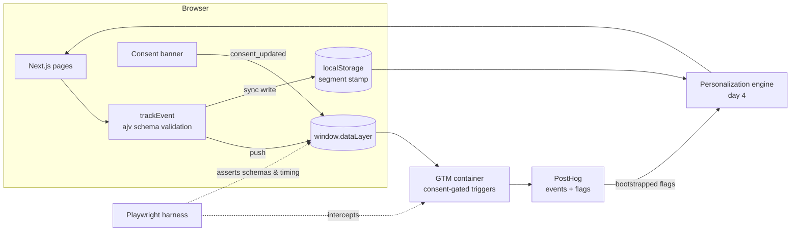

# Architecture

Demo travel site ("Wayfarer Collection") instrumented end-to-end: typed
dataLayer → GTM → PostHog, with schema validation at the edge of the client,
consent gating, same/next-page personalization engineered around the
decision-before-render race condition, and a Playwright harness asserting the
whole thing.

## Pipeline

## Race-condition strategy

See [race-condition.md](race-condition.md) for a full breakdown of the three personalization strategies and why `decided_before_paint` is the critical metric.
See [rule-templates.md](rule-templates.md) for examples of reusable personalization rules.
See [decision-debugger.md](decision-debugger.md) for the `?debug=1` overlay that makes all of this visible live in the browser.

1. **Local-first stamp** — `destination_viewed` synchronously writes the
   segment to localStorage before any network call. Next-page decisions read
   it at zero latency.
2. **Bootstrapped flags** — edge middleware evaluates PostHog flags
   server-side and injects values into the HTML, so `posthog-js` has answers
   at init instead of after `/decide`.
3. **Scoped anti-flicker gate** — the personalizable slot (never the page)
   is held for a tight timeout, falling back to default content.

## Status

- [x] Day 1 — site, dataLayer, schemas, consent stub
- [x] Day 2 — GTM container, tags/triggers, consent mode
- [x] Day 3 — PostHog integration, segments, flags
- [x] Day 4–5 — personalization engine (three strategies)
- [x] Day 6 — Playwright harness
- [x] Day 7 — writeup
