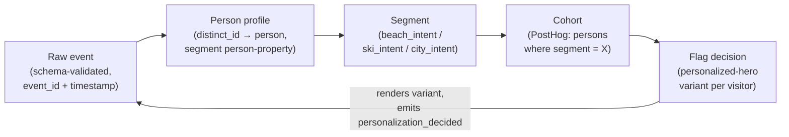
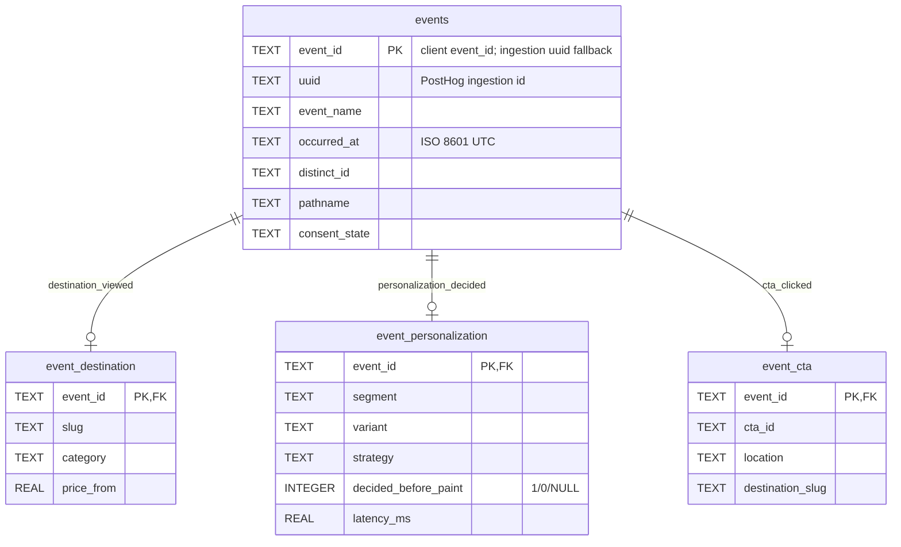

# Data Model & ETL

## The conceptual chain

Every personalization system — this one, Adobe Experience Platform, any of
them — is the same five-stage chain. Here it is for this stack, with the
Adobe names underneath (full mapping in [adobe-mapping.md](adobe-mapping.md)):



| Stage | This stack | Adobe equivalent |
|---|---|---|
| Raw event | JSON-Schema-validated dataLayer event | XDM ExperienceEvent |
| Person profile | PostHog person (distinct_id merge) | Real-Time Customer Profile |
| Segment | `{category}_intent` person property | Profile attribute / computed attribute |
| Cohort | PostHog cohort on the segment property | RTCDP audience |
| Flag decision | `personalized-hero` feature flag | Target activity / offer decision |

The loop closes: the flag decision renders a variant and emits
`personalization_decided`, which is itself a raw event — decisions are
observable data, not side effects.

## Identity model

- **`event_id`** — client-stamped UUID per event (`trackEvent`), the exact-once
  key across dataLayer, delivery layer, and warehouse.
- **`distinct_id`** — device/browser identity (posthog-js).
- **`person_id`** — resolved identity; many distinct_ids can merge into one
  person. Count people with `uniq(person_id)`, never `uniq(distinct_id)`.
- **`segment`** — stamped client-side at interaction time (localStorage +
  cookie), synced to the person profile for cohort building.

## Warehouse schema (ETL target)

`npm run etl` loads a normalized SQLite star-ish schema — one thin fact table,
one satellite table per event family:



Satellites hold the typed payload columns instead of a JSON blob, so warehouse
SQL gets real types (`decided_before_paint INTEGER`, `latency_ms REAL`) — the
same reason XDM insists on typed schemas over freeform properties.

## The ETL ([`scripts/etl.mjs`](../scripts/etl.mjs))

| Phase | What happens |
|---|---|
| **Extract** | `POST /api/projects/512758/query` (PostHog Query API — REST + JSON) with a HogQL statement selecting 30 days of tracked events. Auth: personal API key, `query:read` scope. |
| **Transform** | Zip columns/rows into records; **dedupe on `event_id`** (ingestion `uuid` fallback for rows that predate the current instrumentation — see the drift note in [sql-analysis.md](sql-analysis.md)); type-cast `decided_before_paint` → 0/1, `latency_ms`/`price_from` → numbers, timestamps → ISO 8601 UTC. |
| **Load** | `INSERT OR REPLACE` into SQLite (`data/warehouse.db`) via Node's built-in `node:sqlite` — zero dependencies. Idempotent re-runs, mirroring the client's at-least-once delivery. Prints post-load verification: row counts, duplicate-uuid check, per-event breakdown. |

```bash
# live extract (create a personal API key in PostHog → Settings)
POSTHOG_PERSONAL_API_KEY=phx_... npm run etl

# offline: real event sample committed as a fixture (includes one
# deliberately duplicated row to exercise the dedupe path)
npm run etl -- --fixture
```

Example verified output (fixture mode):

```text
extract: reading fixture fixtures/posthog-events.sample.json
transform: 15 rows → 14 events (1 duplicates dropped)
load: data/warehouse.db
  events                 14 rows
  event_destination      2 rows
  event_personalization  2 rows
  event_cta              2 rows
  duplicate uuids        0 (expected 0)
```

Query the result with any SQLite client, e.g.
`sqlite3 data/warehouse.db "SELECT event_name, count(*) FROM events GROUP BY 1"`.
